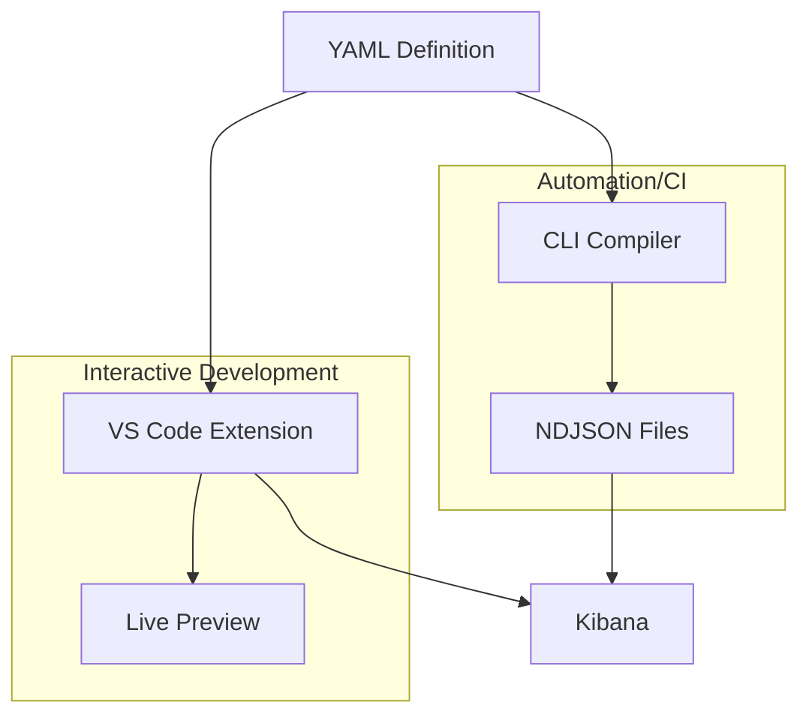

# Kibana dashboard YAML reference

*(Combined from kb-yaml-to-lens: index, architecture, dashboard-decompiling-guide)*

# YAML ➤ Lens Dashboard Compiler

Convert human-friendly YAML dashboard definitions into Kibana NDJSON format.


This tool simplifies the process of creating and managing Kibana dashboards by
allowing you to define them in a clean, maintainable YAML format instead of
hand-crafting complex JSON.

## Getting Started

### VS Code Extension (Recommended)

**Best for interactive development** - Live preview, visual editing, built-in snippets

**No Python installation required!** The extension includes a bundled LSP server binary.

**Installation:**

1. **Install the extension:**
   - **OpenVSX Registry** (Cursor, VS Code forks): Search "Kibana Dashboard Compiler"
   - **Manual**: Download `.vsix` from [releases](https://github.com/strawgate/kb-yaml-to-lens/releases)

2. **Create your first dashboard:**

   Create a new file called `my-dashboard.yaml` and add the following content:

   ```yaml
   dashboards:
   - name: My First Dashboard
     description: A simple dashboard with markdown
     panels:
       - title: Hello Panel
         markdown:
           content: |
             # Hello, Kibana!

             This is my first markdown panel.
         size: {w: 24, h: 15}
   ```

   Or use snippets: type `dashboard` and press Tab to insert a template.

3. **Preview your dashboard:**
   - Save the file (Ctrl+S) to auto-compile
   - Open Command Palette (Ctrl+Shift+P / Cmd+Shift+P)
   - Run **"YAML Dashboard: Preview Dashboard"**

4. **Upload to Kibana:**
   - Configure Kibana URL in VS Code settings
   - Run **"YAML Dashboard: Open in Kibana"**

**Full guide:** [VS Code Extension Documentation](vscode-extension.md)

---

### CLI (For Automation & Scripting)

**Best for:** CI/CD pipelines, batch processing, programmatic usage

**Requirements:** [uv](https://github.com/astral-sh/uv) (recommended) or Python 3.12+

**Installation:** No clone or setup required! Run directly with uvx:

```bash
uvx kb-dashboard-cli compile --help
```

**Your First Dashboard:**

1. Create `inputs/my-dashboard.yaml`:

   ```yaml
   dashboards:
   - name: My First Dashboard
     description: A simple dashboard
     panels:
       - title: Welcome
         size: {w: 24, h: 15}
         markdown:
           content: |
             # Welcome to Kibana!
   ```

2. Compile:

   ```bash
   uvx kb-dashboard-cli compile --input-file inputs/my-dashboard.yaml
   ```

3. Upload to Kibana:

   ```bash
   uvx kb-dashboard-cli compile --input-file inputs/my-dashboard.yaml --upload --kibana-url http://localhost:5601
   ```

**Full guide:** [CLI Documentation](CLI.md)

---

## Features

- **YAML-based Definition** – Define dashboards, panels, filters, and queries in simple, readable YAML.
- **Kibana Integration** – Compile to NDJSON format compatible with Kibana 8+.
- **Rich Panel Support** – Support for Lens (metric, pie, XY charts), Markdown, Links, Image, and Search panels.
- **Color Palettes** – Choose from color-blind safe, brand, and other built-in color palettes.
- **Interactive Controls** – Add options lists, range sliders, and time sliders with chaining support.
- **Flexible Filtering** – Use a comprehensive filter DSL (exists, phrase, range) or raw KQL/Lucene/ESQL queries.
- **Direct Upload** – Compile and upload to Kibana in one step, with support for authentication and API keys.
- **Screenshot Export** – Generate high-quality PNG screenshots of your dashboards programmatically.

## More Examples

### Lens Metric Panel

Here's a dashboard with a Lens metric panel displaying a count:

```yaml
dashboards:
- name: Metric Dashboard
  description: A dashboard with a single metric panel
  panels:
    - title: Document Count
      type: lens
      size: {w: 24, h: 15}
      data_view: your-index-pattern-*
      chart:
        type: metric
        metrics:
          - type: count
            label: Total Documents
```

### Programmatic Alternative

While this guide focuses on YAML, you can also create dashboards entirely in Python code. This approach offers:

- Dynamic dashboard generation based on runtime data
- Type safety with Pydantic models
- Reusable dashboard templates and components
- Integration with existing Python workflows

See the [Programmatic Usage Guide](programmatic-usage.md) for examples and patterns.

## Next Steps

### Enhance Your Workflow

- **[VS Code Extension Features](vscode-extension.md)** - Visual grid editor, code snippets, keyboard shortcuts
- **[CLI Advanced Usage](CLI.md)** - Environment variables, API keys, CI/CD integration
- **[Dashboard Decompiling Guide](dashboard-decompiling-guide.md)** - Convert existing Kibana JSON dashboards to YAML
- **[Complete Examples](examples/index.md)** - Production-ready dashboard templates

### User Guide

Reference documentation for YAML dashboard syntax:

- **[Dashboard Configuration](dashboard/dashboard.md)** - Dashboard-level settings and options.
- **[Panel Types](panels/base.md)** - Available panel types (Markdown, Charts, Images, Links, etc.).
- **[Dashboard Controls](controls/config.md)** - Interactive filtering controls.
- **[Filters & Queries](filters/config.md)** - Data filtering and query configuration.

### Developer Guide

Advanced documentation for contributors and programmatic usage:

- **[Architecture Overview](architecture.md)** - Technical design and data flow.
- **[Programmatic Usage](programmatic-usage.md)** - Using the Python API directly to generate dashboards.
- **[API Reference](api/index.md)** - Auto-generated Python API documentation.
- **[Contributing Guide](https://github.com/strawgate/kb-yaml-to-lens/blob/main/CONTRIBUTING.md)** - How to contribute and add new capabilities.
- **[Kibana Architecture Reference](kibana-architecture.md)** - Understanding Kibana's internal structure.

## How It Works



## License

MIT

### Third-Party Content

Some example dashboards in `packages/kb-dashboard-docs/content/examples/` are derived from the [Elastic integrations repository](https://github.com/elastic/integrations) and are licensed under the [Elastic License 2.0](https://github.com/strawgate/kb-yaml-to-lens/blob/main/licenses/ELASTIC-LICENSE-2.0.txt). Specifically:

- `packages/kb-dashboard-docs/content/examples/system_otel/` - System monitoring dashboards for OpenTelemetry
- `packages/kb-dashboard-docs/content/examples/docker_otel/` - Docker container monitoring dashboards for OpenTelemetry

See [licenses/README.md](https://github.com/strawgate/kb-yaml-to-lens/blob/main/licenses/README.md) for the complete list of affected files.

## Support

For issues and feature requests, please refer to the repository's issue tracker.

# Dashboard Compiler Architecture

This document describes the architecture of the dashboard compiler, which converts a simplified YAML representation of Kibana dashboards into the complex Kibana dashboard JSON format.

## Goal

The primary goal is to provide a human-readable and maintainable way to define Kibana dashboards using YAML, abstracting away the complexities of the native JSON structure.

## Design

The compiler is designed using a layered approach with distinct components responsible for different stages of the conversion process.

1. **YAML Loading and Parsing:**
    - The process begins by loading the YAML configuration file.
    - The `PyYAML` library is used to parse the YAML content into a Python dictionary.

2. **Pydantic Model Representation:**
    - The codebase uses a three-layer pattern with separate models for input configuration and output views:
      - **Config Models** (`**/config.py`): Define the YAML schema structure using Pydantic, handling validation and ensuring the parsed YAML conforms to the defined schema. These models use a `BaseCfgModel` base class.
      - **View Models** (`**/view.py`): Define the Kibana JSON output structure using Pydantic. These models use a `BaseVwModel` base class and include custom serialization logic.
      - **Compile Functions** (`**/compile.py`): Transform config models into view models, handling the specific formatting and mapping required for each component.
    - Each major component of a dashboard (Dashboard, Panel, Grid, etc.) and its variations (different panel types, Lens visualizations, dimensions, metrics, etc.) follows this pattern.
    - A custom validator in the base `Panel` class is used to dynamically instantiate the correct panel subclass based on the `type` field in the YAML data.

3. **Compilation Process:**
    - Compile functions in `compile.py` files take config model instances and transform them into view model instances.
    - These functions handle the specific formatting and nesting required for each element (panels, visualizations, layers, etc.).
    - The top-level dashboard compilation orchestrates the compilation of all components (panels, controls, filters, queries) and assembles the final Kibana JSON structure.
    - View models use Pydantic's `model_dump_json()` method to serialize to JSON.

4. **ID and Reference Management (Future Enhancement):**
    - The Kibana dashboard JSON relies heavily on unique IDs and references between components.
    - A future enhancement will involve implementing a system for generating unique IDs and managing these references during the compilation process to ensure the generated dashboards are valid and functional in Kibana.

5. **Error Handling (Future Enhancement):**
    - Robust error handling will be added to catch and report issues during YAML parsing, data validation, and JSON compilation.

## Components

The codebase is organized into packages:

**Core Package (`packages/kb-dashboard-core/src/kb_dashboard_core/`):**

- **`dashboard_compiler.py`:** Main entry point containing the core compilation orchestration functions (`load`, `render`, `dump`).
- **`dashboard/`:** Top-level dashboard compilation with `config.py`, `view.py`, and `compile.py`.
- **`panels/`:** Panel compilation with subdirectories for each panel type (markdown, links, images, search, charts).
- **`panels/charts/`:** Chart-specific compilation with subdirectories for different chart types (metric, pie, xy) and components (lens/esql metrics, dimensions, columns).
- **`controls/`:** Control group compilation for dashboard interactivity.
- **`filters/`:** Filter compilation supporting various filter types.
- **`queries/`:** Query compilation for KQL, Lucene, and ES|QL.

**CLI Package (`packages/kb-dashboard-cli/src/dashboard_compiler/`):**

- **`cli.py`:** Command-line interface for compiling dashboards and uploading to Kibana.
- **`lsp/`:** Language Server Protocol implementation for VS Code extension.
- **`sample_data/`:** Sample data loading utilities.
- **`tools/`:** CLI tooling utilities.

**CLI Package Tests (`packages/kb-dashboard-cli/tests/`):**

- Test files including snapshot tests to verify compiler output against expected JSON.

## Data Flow

1. YAML file is read.
2. YAML content is parsed into a Python dictionary.
3. The dictionary is validated and converted into a hierarchy of Pydantic config model objects.
4. Compile functions transform the config model hierarchy into view model objects.
5. The compile functions are called recursively on nested objects to build the view model structure.
6. View models are serialized to JSON using Pydantic's `model_dump_json()` method.
7. A Kibana-compatible NDJSON file is generated.

```mermaid
graph TD
    A[YAML File] --> B{Load & Parse YAML}
    B --> C[Python Dictionary]
    C --> D{Pydantic Validation}
    D --> E[Config Model Hierarchy]
    E --> F{Compile Functions}
    F --> G[View Model Hierarchy]
    G --> H{model_dump_json}
    H --> I[Kibana JSON/NDJSON]

# Dashboard Decompiling Guide: Converting Kibana JSON to YAML

This guide provides instructions for converting Kibana dashboard JSON files into YAML format for kb-yaml-to-lens. It is designed to be consumed by LLMs (Large Language Models) to perform conversions efficiently.

## Quick Reference

**Complete Documentation**: For full schema reference and examples, use [llms-full.txt](https://strawgate.com/kb-yaml-to-lens/llms-full.txt) which contains all project documentation.

**Workflow**: `kb-dashboard fetch` → `kb-dashboard disassemble` → Convert to YAML → `kb-dashboard compile` → Validate

## Fetching Dashboard from Kibana

Retrieve a dashboard directly from Kibana using a URL or ID:

```bash
# Using dashboard URL
kb-dashboard fetch "https://kibana.example.com/app/dashboards#/view/my-id" \
    --output dashboard.ndjson

# Using dashboard ID
kb-dashboard fetch my-dashboard-id --output dashboard.ndjson
```

**Input Types:**

The `fetch` command accepts two types of input:

1. **Dashboard URL** - Full Kibana dashboard URL (e.g., `https://kibana.example.com/app/dashboards#/view/my-id`)
2. **Dashboard ID** - Plain dashboard ID (e.g., `my-dashboard-id`)

**How it works:**

- If the input looks like a URL, the dashboard ID is extracted from the URL
- Otherwise, the input is treated as a plain dashboard ID

**Authentication Options:**

```bash
# API Key authentication (recommended)
kb-dashboard fetch my-dashboard-id --output dashboard.ndjson \
    --kibana-api-key "your-api-key"

# Username/password authentication
kb-dashboard fetch my-dashboard-id --output dashboard.ndjson \
    --kibana-username user --kibana-password pass

# Specific Kibana space
kb-dashboard fetch my-dashboard-id --output dashboard.ndjson \
    --kibana-space-id "my-space"
```

**Input Formats Supported:**

- **URL (standard):** `https://kibana.example.com/app/dashboards#/view/{id}`
- **URL (with space):** `https://kibana.example.com/s/{space}/app/dashboards#/view/{id}`
- **URL (with query params):** `https://kibana.example.com/app/dashboards#/view/{id}?_g=...`
- **Plain dashboard ID:** `my-dashboard-id` or `dashboard-123`

## Disassembly

Break dashboard JSON into components:

```bash
kb-dashboard disassemble dashboard.ndjson -o output_dir/
```

**Output Structure:**

```text
output_dir/
├── metadata.json       # Dashboard title, description, id
├── options.json        # Display options (margins, colors, etc.)
├── controls.json       # Dashboard controls (if present)
├── filters.json        # Dashboard-level filters (if present)
├── references.json     # Data view references
└── panels/             # Individual panel JSON files
    ├── 000_panel-1_lens.json
    ├── 001_panel-2_markdown.json
    └── ...
```

## Conversion Strategy

### Incremental Approach

Convert one panel at a time and validate after each addition:

1. Create minimal dashboard structure
2. Add first panel
3. Compile: `kb-dashboard compile`
4. Fix errors if any
5. Repeat for remaining panels

### Minimal YAML

Omit fields that match defaults. Common defaults:

**Dashboard Level:**

- `use_margins: true`
- `sync_colors: false`
- `sync_cursor: true`
- `sync_tooltips: false`
- `hide_panel_titles: false`

**Panel Level:**

- Legend: `show: true`, `position: right`
- Values: `show_values: false`
- Breakdown: `size: 5`

Reference the documentation in llms-full.txt for component-specific defaults.

## Component Mapping

### Dashboard Metadata

**Input (metadata.json):**

```json
{
  "id": "my-dashboard-id",
  "title": "System Metrics Overview",
  "description": "Dashboard showing system performance metrics"
}
```

**Output (YAML):**

```yaml
---
dashboards:
  - name: System Metrics Overview
    description: Dashboard showing system performance metrics
    panels: []  # Panels will be added incrementally
```

### Markdown Panels

**Input:**

```json
{
  "type": "markdown",
  "gridData": {"x": 0, "y": 0, "w": 48, "h": 3},
  "panelConfig": {
    "markdown": "# Title\n\nContent here"
  }
}
```

**Output:**

```yaml
- markdown:
    content: |
      # Title

      Content here
  size: {w: 48, h: 3}
```

### Lens Metric Panels

**Input:**

```json
{
  "type": "lens",
  "gridData": {"x": 0, "y": 3, "w": 24, "h": 15},
  "embeddableConfig": {
    "attributes": {
      "title": "Total Documents",
      "visualizationType": "lnsMetric",
      "state": {
        "datasourceStates": {
          "formBased": {
            "layers": {
              "layer1": {
                "columns": {
                  "col1": {
                    "operationType": "count",
                    "label": "Count"
                  }
                }
              }
            }
          }
        }
      },
      "references": [
        {
          "type": "index-pattern",
          "id": "logs-*",
          "name": "indexpattern-datasource-layer-layer1"
        }
      ]
    }
  }
}
```

**Output:**

```yaml
- title: Total Documents
  size: {w: 24, h: 15}
  position: {x: 0, y: 3}
  lens:
    type: metric
    data_view: logs-*
    primary:
      aggregation: count
```

### Lens Pie Charts

**Input:**

```json
{
  "type": "lens",
  "visualizationType": "lnsPie",
  "state": {
    "datasourceStates": {
      "formBased": {
        "layers": {
          "layer1": {
            "columns": {
              "col1": {
                "operationType": "terms",
                "sourceField": "status",
                "params": {"size": 5, "orderBy": {"type": "column", "columnId": "col2"}, "orderDirection": "desc"}
              },
              "col2": {
                "operationType": "count"
              }
            }
          }
        }
      }
    }
  }
}
```

**Output:**

```yaml
- title: Status Breakdown
  size: {w: 24, h: 15}
  position: {x: 24, y: 3}
  lens:
    type: pie
    data_view: logs-*
    dimensions:
      - field: status
        type: values
        size: 5
    metrics:
      - aggregation: count
```

### Dashboard Controls

**Input (controls.json):**

```json
{
  "panelsJSON": "[{\"type\":\"optionsListControl\",\"order\":0,\"width\":\"medium\",\"fieldName\":\"namespace\"}]",
  "controlStyle": "oneLine"
}
```

**Output:**

```yaml
controls:
  - type: options
    label: Namespace
    data_view: metrics-*
    field: namespace
```

Reference [Dashboard Controls](controls/config.md) for complete options.

### Dashboard Filters

**Input (filters.json):**

```json
[
  {
    "meta": {
      "type": "phrase",
      "key": "service.name",
      "params": {"query": "web-server"}
    }
  }
]
```

**Output:**
Reference [Filters & Queries](filters/config.md) for filter conversion.

## Panel Type Reference

| Kibana Type | YAML Type | Documentation |
| ----------- | -------------------------- | ---------------------------------------- |
| `lnsMetric` | `lens.type: metric` | [Metric Charts](panels/metric.md) |
| `lnsPie` | `lens.type: pie` | [Pie Charts](panels/pie.md) |
| `lnsXY` | `lens.type: line/bar/area` | [XY Charts](panels/xy.md) |
| `lnsGauge` | `lens.type: gauge` | [Gauge Charts](panels/gauge.md) |
| `lnsDatatable` | `lens.type: table` | [Datatable Charts](panels/datatable.md) |
| `markdown` | `markdown` | [Markdown Panels](panels/markdown.md) |
| `links` | `links` | [Links Panels](panels/links.md) |

For ES|QL-based panels, see [ES|QL Panels](panels/esql.md).

## Validation

### Compile

```bash
kb-dashboard compile --input-dir my-yaml/ --output-dir compiled/
```

### Compare Structure

Use the comparison helper script to quickly check panel counts and types:

```bash
scripts/compare_panel_counts.sh original.ndjson compiled/output.ndjson
```

### Verification Workflow (Round-Trip Testing)

For thorough validation, use this round-trip workflow to verify the compiled output matches the original:

1. **Compile YAML to JSON:**

   ```bash
   kb-dashboard compile --input-dir my-yaml/ --output-dir /tmp/compiled/
   ```

   **IMPORTANT:** Fix any compilation errors before proceeding. The YAML must compile successfully.

2. **Disassemble both original and compiled dashboards:**

   ```bash
   # Disassemble original
   kb-dashboard disassemble original.ndjson -o /tmp/original_disassembled/

   # Disassemble compiled
   kb-dashboard disassemble /tmp/compiled/output.ndjson -o /tmp/compiled_disassembled/
   ```

3. **Compare panel structures:**

   Use the comparison helper script to analyze differences:

   ```bash
   python3 scripts/compare_dashboards.py /tmp/original_disassembled /tmp/compiled_disassembled
   ```

   This will show panel counts, types, and identify any mismatches.

4. **Verify panel structure and configuration:**

   Use `jq` to compare specific panel configurations between original and compiled:

   ```bash
   # Compare specific panel JSON structures
   diff -u \
     <(jq '.embeddableConfig.attributes.state' /tmp/original_disassembled/panels/003_panel-4_lens.json) \
     <(jq '.embeddableConfig.attributes.state' /tmp/compiled_disassembled/panels/003_panel-4_lens.json)
   ```

   **What to verify for each panel type:**

   **XY Charts (line, bar, area):**
   - Chart type matches (`seriesType` in original → `type` in YAML)
   - Stacking mode preserved (if `yConfig[].axisMode: stacked` exists)
   - Legend configuration matches (`legend.isVisible`, `legend.position`)
   - Dimensions properly mapped (count columns by `isBucketed: true`)
   - Breakdown configurations match (field names, size parameters)

   **Datatables:**
   - All bucketed columns appear as row dimensions
   - Size parameters match for each dimension
   - Metric columns preserve aggregation functions

   **All Lens panels:**
   - Aggregation functions match (median, average, sum, etc.)
   - Field names are exact (including namespace prefixes)
   - Format settings preserved (percent, bytes, number, etc.)

**Understanding discrepancies:**

When comparing original and compiled dashboards, some differences are expected:

- ✅ **Expected (safe):** Panel IDs differ, minor query formatting, panel order variations
- ⚠️ **Needs investigation:** Panel count mismatch, visualization type changes, missing dimensions/metrics, field name differences

**Verification checklist:**

Before considering a conversion complete:

- [ ] YAML compiles without errors
- [ ] Panel counts match (or differences are documented)
- [ ] Panel types match (lens, visualization, links, markdown)
- [ ] Chart configurations preserved (type, stacking, legends)
- [ ] All dimensions and breakdowns accounted for
- [ ] Size parameters match original values
- [ ] Field names and aggregations verified

## Common Patterns

### Lens Operation Mapping

| Kibana Operation | YAML Aggregation | Notes |
| ---------------- | ------------------------ | --------------------------- |
| `count` | `aggregation: count` | Document count |
| `sum` | `aggregation: sum` | Sum of field values |
| `avg` | `aggregation: average` | Average of field values |
| `min` | `aggregation: min` | Minimum value |
| `max` | `aggregation: max` | Maximum value |
| `median` | `aggregation: median` | Median value |
| `percentile` | `aggregation: percentile` | Requires `percentile` param |
| `terms` | `type: values` | Used in breakdowns/slices |
| `date_histogram` | `type: date_histogram` | Time-based dimension |
| `range` | `type: range` | Range-based dimension |

### XY Chart Dimensions

**Input (Kibana lens state):**

```json
{
  "columns": {
    "col1": {
      "operationType": "date_histogram",
      "sourceField": "@timestamp",
      "params": {"interval": "auto"}
    },
    "col2": {
      "operationType": "avg",
      "sourceField": "system.cpu.total.norm.pct"
    }
  }
}
```

**Output:**

```yaml
lens:
  type: line
  data_view: metrics-*
  dimensions:
    - field: '@timestamp'
      type: date_histogram
  metrics:
    - field: system.cpu.total.norm.pct
      aggregation: average
```

### Multi-Dimension Breakdowns

**Input:**

```json
{
  "columns": {
    "col1": {"operationType": "date_histogram", "sourceField": "@timestamp"},
    "col2": {"operationType": "terms", "sourceField": "host.name"},
    "col3": {"operationType": "avg", "sourceField": "cpu.usage"}
  }
}
```

**Output:**

```yaml
lens:
  type: line
  data_view: metrics-*
  dimensions:
    - field: '@timestamp'
      type: date_histogram
  breakdown:
    - field: host.name
      type: values
  metrics:
    - field: cpu.usage
      aggregation: average
```

## Error Resolution

### Schema Validation Errors

```text
ValidationError: 'type' is a required property
```

**Solution:** Check required fields in panel type documentation. Each panel type has specific required fields.

### Type Errors

```text
TypeError: Expected string, got int
```

**Solution:** Verify field types match schema. Common issues:

- Numbers as strings: use `100` not `"100"`
- Booleans as strings: use `true` not `"true"`

### Unsupported Panel Types

```text
Error: Panel type 'vega' is not supported
```

**Solution:** See [supported panel types](panels/base.md). For unsupported panels, either:

- Create placeholder markdown panel
- Skip the panel and document it

### Reference Resolution

```text
Error: Data view reference 'logs-*' not found
```

**Solution:** Ensure data views exist in target Kibana instance or are defined in YAML.

## Complete Example

**Disassembled Panel (001_panel-2_lens.json):**

```json
{
  "type": "lens",
  "gridData": {"x": 0, "y": 3, "w": 24, "h": 15},
  "embeddableConfig": {
    "attributes": {
      "title": "Total Documents",
      "visualizationType": "lnsMetric",
      "state": {
        "datasourceStates": {
          "formBased": {
            "layers": {
              "layer1": {
                "columns": {
                  "col1": {"operationType": "count", "label": "Count"}
                }
              }
            }
          }
        }
      },
      "references": [{"type": "index-pattern", "id": "logs-*"}]
    }
  }
}
```

**Converted YAML:**

```yaml
---
dashboards:
  - name: Application Monitoring
    description: Real-time application metrics
    panels:
      - title: Total Documents
        size: {w: 24, h: 15}
        position: {x: 0, y: 3}
        lens:
          type: metric
          data_view: logs-*
          primary:
            aggregation: count
```

**Validation:**

```bash
kb-dashboard compile
# Success! 1 panel
```

## Additional Resources

- **Complete Documentation**: [llms-full.txt](https://strawgate.com/kb-yaml-to-lens/llms-full.txt)
- **Examples**: [Complete Examples](examples/index.md)
- **Aerospike Examples**: [Complex real-world dashboards](examples/aerospike/overview.yaml)
- **Panel Type Docs**: [Panel Types Overview](panels/base.md)
- **Controls**: [Dashboard Controls](controls/config.md)
- **Filters**: [Filters & Queries](filters/config.md)
- **Advanced Topics**: [ES|QL Views](advanced/esql-views.md), [Color Assignments](advanced/color-assignments.md)

